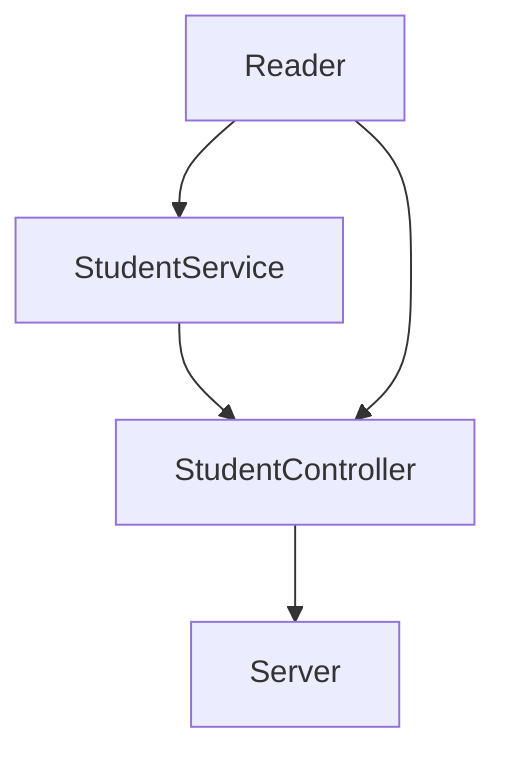
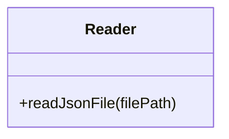
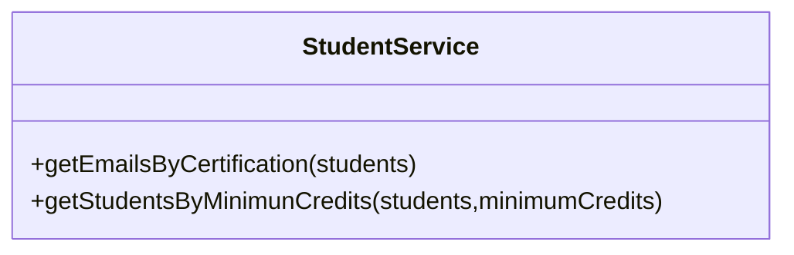
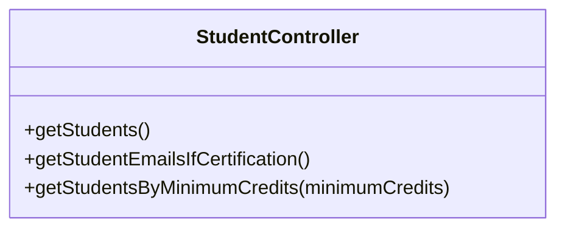

### Code Challenge API
Para este proyecto se desarrollo una API con el uso de express como parte de las actividades del curso de Node JS de LaunchX.

 El objetivo es crear una API que consulte una db en formato JSON de los estudiantes de Visual Partner-Ship que cumpla con los siguiente:
 
### Requerimentos
1. Habilitar un endpoint para consultar todos los estudiantes con todos sus campos.
2. Habilitar un endpoint para consultar los emails de todos los estudiantes que tengan certificación `haveCertification`.
3. Habilitar un endpoint para consultar todos los estudiantes que tengan `credits` mayor a 500.

#### Dependencias y Herramientas utilizadas
- Jest *(26.0.0)* 
- Linter
- Express
- Pruebas automatizadas con Github Actions 
### Estructura
La estructura del proyecto es la siguiente:

La parte del proyecto que tendrá contacto con el server será el StudentController que se encargará de implementar la lógica necesaria para cumplir los quererimentos con ayuda del StudentService y el Reader del archivo JSON.

### Clases
Clases y métodos utilizados en el proyecto:

### API
Los endpoints habilitados en `server.js` para el proyecto funcionan de la siguiente manera:

| Endpoint | Request | Response |
|---|---|---|
| `localhost:3000//v1/students` | `localhost:3000//v1/students` | Obtiene la lista de los estudiantes y sus campos. |
| `localhost:3000/v1/students/haveCertification` | `localhost:3000/v1/students/haveCertification` | Obtiene la lista de emails de estudiantes que tengan certificación |
| `localhost:3000/v1/students/credits/:number` | `localhost:3000/v1/students/credits/500` | Obtiene la lista de estudiantes con créditos mayores a 500 |
### Funcionamiento

